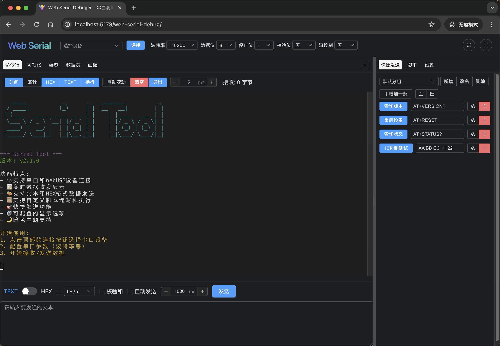

# [Web Serial Debugger](https://qdsang.github.io/web-serial-debug/)

一个基于 Web Serial 的串口调试工具。 [https://qdsang.github.io/web-serial-debug/](https://qdsang.github.io/web-serial-debug/)

## Demo




## 功能特点

- 🔌 支持串口和WebUSB设备连接
- 📝 实时数据收发显示
- 🎨 支持文本和HEX格式数据发送
- 📜 支持自定义脚本编写和执行
- 🎯 快捷发送功能
- ⚙️ 可配置的显示选项
- 🌙 暗色主题支持

## 使用说明

### 连接设备
1. 点击连接按钮选择串口设备
2. 选择合适的波特率和其他串口参数
3. 连接成功后即可开始收发数据

### 数据发送
- 支持文本和HEX格式数据发送
- 可以保存常用的发送内容为快捷发送项
- 支持自定义脚本发送数据

### 脚本功能
可以编写JavaScript脚本来实现自动化操作，支持以下API：
- `sendText(text)` - 发送文本数据
- `sendHex(hex)` - 发送HEX格式数据
- `sleep(ms)` - 延时指定毫秒数

## 技术栈

- Vue 3
- TypeScript
- Vite
- Element Plus
- CodeMirror 6
- Xterm.js

## 开发环境要求

- Node.js >= 18.0.0
- 支持 Web Serial API 的现代浏览器（如 Chrome、Edge）

## 安装

```bash
# 安装依赖
yarn install

# 启动开发服务器
yarn dev

# 构建生产版本
yarn build
```

## 构建

```bash
# 构建生产版本
yarn build

# 预览生产版本
yarn preview
```

https://github.com/devanlai/webstlink

## 许可证

MIT License
